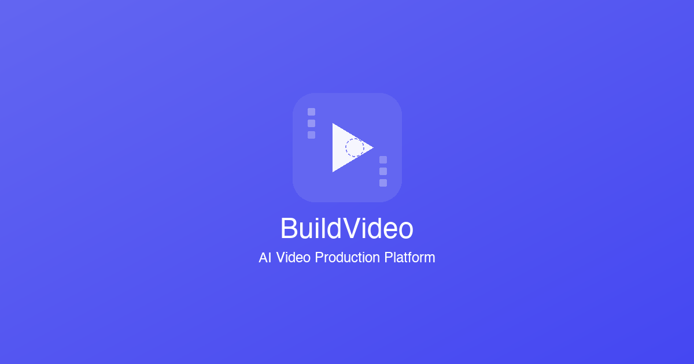

<p align="center">
  
</p>

<p align="center">
  <a href="#-quick-start">English</a> | <a href="#-快速开始">中文</a>
</p>

# BuildVideo AI 影视 Studio

> ⚠️ **测试版声明**：本项目目前处于测试初期阶段，存在部分 bug 和不完善之处。我们正在快速迭代更新中，欢迎反馈问题和需求！
>
> ⚠️ **Beta Notice**: This project is in early beta. Bugs and rough edges exist. We're iterating fast — feel free to open an Issue!

一款基于 AI 技术的短剧/漫画视频制作工具，支持从小说文本自动生成分镜、角色、场景，并制作成完整视频。

An AI-powered tool for creating short drama / comic videos — automatically generates storyboards, characters, and scenes from novel text, then assembles them into complete videos.

---

## ✨ 功能特性 / Features

| | 中文 | English |
|---|---|---|
| 🎬 | AI 剧本分析 - 自动解析小说，提取角色、场景、剧情 | AI Script Analysis - parse novels, extract characters, scenes & plot |
| 🎨 | 角色 & 场景生成 - AI 生成一致性人物和场景图片 | Character & Scene Generation - consistent AI-generated images |
| 📽️ | 分镜视频制作 - 自动生成分镜头并合成视频 | Storyboard Video - auto-generate shots and compose videos |
| 🎙️ | AI 配音 - 多角色语音合成 | AI Voiceover - multi-character voice synthesis |
| 🌐 | 多语言支持 - 中文 / 英文界面，右上角一键切换 | Bilingual UI - Chinese / English, switch in the top-right corner |

## 🚀 快速开始

**前提条件**：安装 [Docker Desktop](https://docs.docker.com/get-docker/)

```bash
git clone https://github.com/BuildVideoAI/buildvideo.git
cd buildvideo
docker compose up -d
```

访问 [http://localhost:13000](http://localhost:13000) 开始使用！

> 首次启动会自动完成数据库初始化，无需任何额外配置。

> ⚠️ **如果遇到网页卡顿**：HTTP 模式下浏览器可能限制并发连接。可安装 [Caddy](https://caddyserver.com/docs/install) 启用 HTTPS：
> ```bash
> caddy run --config Caddyfile
> ```
> 然后访问 [https://localhost:1443](https://localhost:1443)

### 🔄 更新到最新版本

```bash
git pull
docker compose down && docker compose up -d --build
```

---

## 🚀 Quick Start

**Prerequisites**: Install [Docker Desktop](https://docs.docker.com/get-docker/)

```bash
git clone https://github.com/BuildVideoAI/buildvideo.git
cd buildvideo
docker compose up -d
```

Visit [http://localhost:13000](http://localhost:13000) to get started!

> The database is initialized automatically on first launch — no extra configuration needed.

> ⚠️ **If you experience lag**: HTTP mode may limit browser connections. Install [Caddy](https://caddyserver.com/docs/install) for HTTPS:
> ```bash
> caddy run --config Caddyfile
> ```
> Then visit [https://localhost:1443](https://localhost:1443)

### 🔄 Updating to the Latest Version

```bash
git pull
docker compose down && docker compose up -d --build
```

---

## 🔧 API 配置 / API Configuration

启动后进入**设置中心**配置 AI 服务的 API Key，内置配置教程。

After launching, go to **Settings** to configure your AI service API keys. A built-in guide is provided.

> 💡 **推荐 / Recommended**: Tested with ByteDance Volcano Engine (Seedance, Seedream) and Google AI Studio (Banana). Text models currently require OpenRouter API.

---

## 📦 技术栈 / Tech Stack

- **Framework**: Next.js 15 + React 19
- **Database**: MySQL + Prisma ORM
- **Queue**: Redis + BullMQ
- **Styling**: Tailwind CSS v4
- **Auth**: NextAuth.js

---

## 🤝 参与方式 / Contributing

欢迎你通过以下方式参与：

- 🐛 提交 [Issue](https://github.com/BuildVideoAI/buildvideo/issues) 反馈 Bug
- 💡 提交 [Issue](https://github.com/BuildVideoAI/buildvideo/issues) 提出功能建议
- 🔧 提交 Pull Request

You're welcome to contribute by:

- 🐛 Filing [Issues](https://github.com/BuildVideoAI/buildvideo/issues) — report bugs
- 💡 Filing [Issues](https://github.com/BuildVideoAI/buildvideo/issues) — propose features
- 🔧 Submitting Pull Requests

---

**Made with ❤️ by BuildVideo team**
